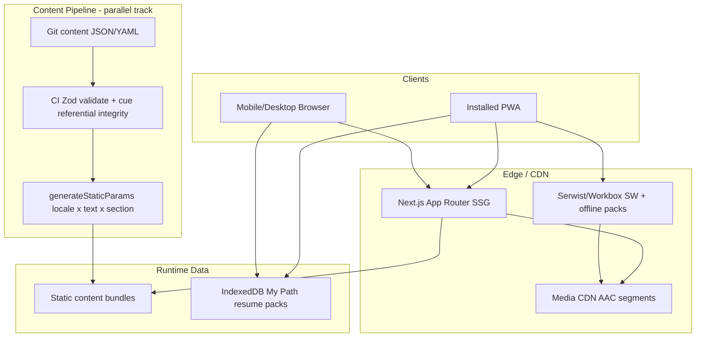
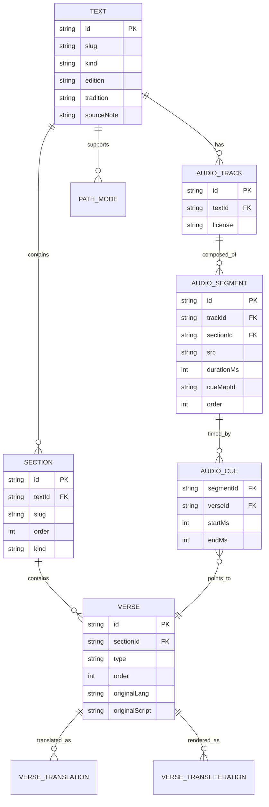
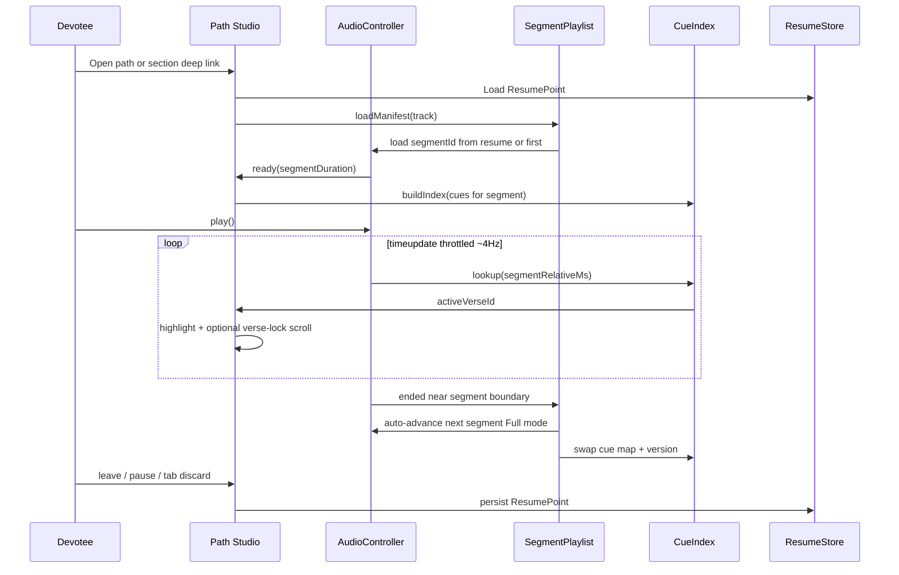
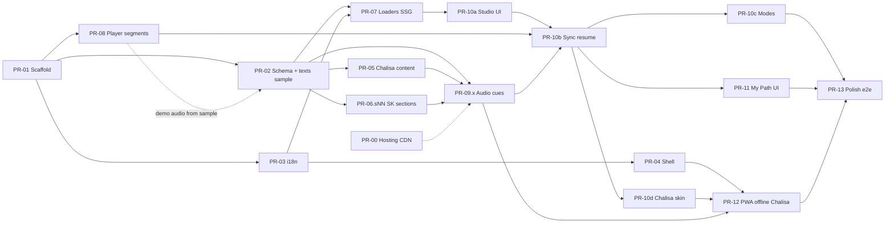

# Hanumat — Product & Systems Design Document

| Field | Value |
|-------|-------|
| **Document** | Hanumat — Digital Mandir Platform |
| **Product brand** | **Hanumat** |
| **Author** | TBD (Engineering) |
| **Date** | 2026-07-22 |
| **Status** | Draft — product-locked for v1 build |
| **Version** | **0.2.4** |
| **Prior version** | 0.2.3 (product lock); 0.2.2; 0.2.1 (R1–R9); 0.2.0 (Issues 1–27); 0.1.0 initial |
| **Product lock** | `docs/PRODUCT-LOCK-v1.md` (binding owner decisions) |
| **Audience** | Product, Engineering, Content, Design, Editorial |
| **Workspace** | `C:\Users\Sabyasachi\Desktop\Hanuman Chalisha` (greenfield) |

> **v1 supersede notice (0.2.4):** **[Appendix H](#appendix-h--product-lock-v1-binding-overrides)** and **`docs/PRODUCT-LOCK-v1.md`** are the binding contract for public v1. Where earlier body text, tables, Key Decisions, or PR notes conflict with Appendix H / PRODUCT-LOCK-v1 (e.g. dual-review staffing, hosting default, commissioned-audio gate, PWA library name, PR-26), **Appendix H + PRODUCT-LOCK win**. Body sections below retain pre-lock context; soft notes mark the v1 lock so implementers are not blocked by stale wording.

---

## Overview

**Hanumat** is a greenfield product: a modern, multilingual, audio-first web application that serves as the **one definitive digital mandir** for devotees of Hanuman ji. It is not a static scripture dump or a “Chalisa site with extras.” It is a living path of bhakti — covering **Sundar Kand** (flagship, equal to Chalisa), Chalisa, stotra, katha, mantra, aarti, puja/vrat/calendar — with original script, transliteration, meaning, and high-quality timed audio in Indian languages first.

This document is the **engineering build contract** for implementation: product IA, Wave 0 Definition of Done, content model (including segmented audio), system architecture, locked Wave 0 stack defaults, Path Studio (desktop + mobile), i18n, editorial workflow, security, observability, rollout, risks, alternatives, key decisions, golden fixture, and an incremental PR plan with a **parallel content track**.

**Working taglines:**  
- “One mandir. Every path. Every language.”  
- “The complete path of Hanuman bhakti.”

**Product name:** **Hanumat** (locked). **Domain:** **hanumat.life** (product lock v1).

---

## Background & Motivation

### Current state

- Workspace is **empty** (no existing codebase, CMS, or content pipeline).
- Devotees today assemble practice across fragmented YouTube paths, PDFs with OCR errors, WhatsApp audio, temple calendars, and partial apps. Quality of chaupai accuracy, Awadhi/Hindi orthography, and timed meaning varies wildly.
- Sundar Kand and Chalisa are daily/weekly practice for millions; long-form path (1.5–3 hours) plus multi-day parayan needs resume, offline, and calm UX that most generic scripture apps do not provide.
- Multilingual devotees (Hindi, Bengali, Tamil, etc.) lack a single reverent surface where script, sound, and meaning travel together.

### Pain points we solve

| Pain | Product response |
|------|------------------|
| Garbled chaupais / unsourced text | Source-noted canon; dual-review editorial workflow (**v1 lock:** sole-owner sign-off; second human waived until assigned — Appendix H) |
| Audio without sync / meaning | Path Studio: verse flow + JSON cues + meaning drawer |
| Sundar Kand treated as secondary | Flagship Path product equal to Chalisa (same completeness bar) |
| Language as afterthought | Locale-first routing; Indian scripts first-class typography |
| Fear-based “which path when” | Calm, tradition-noted guidance; Sankat Shelf without panic |
| Data/offline constraints in India | PWA, low-data mode; Chalisa offline pack in Wave 0; SK section packs Wave 1 |
| Ads breaking sacred space | No ads inside Path Studio; monetization outside path surface |

### Why now

Greenfield allows **static generation (SSG) per locale and section** for SEO (SSR is **not** required for Wave 0; content updates = redeploy — see A8 / Key Decision #29), a content model that treats **path + audio + translation** as first-class entities, and cinematic bhakti design without legacy schema debt.

### Team & feasibility assumptions

Wave 0 is a **multi-track program**, not a single-engineer weekend project:

| Track | Skills | Assumption (adjust when staffed) |
|-------|--------|----------------------------------|
| App engineering | Next.js, a11y, audio | 1–2 engineers |
| Content engineering | Zod schemas, loaders, cue tooling | Shared with app or 0.5 engineer |
| Editorial (Awadhi/Hindi Manas) | Orthography, meaning HI/EN | Ideal: 1–2 editors + 1 reviewer. **v1 lock:** sole-owner sign-off (dual approval waived until second human assigned) |
| Audio | Recitation license, commission, **or TTS path-assist** + cue alignment | **v1 lock:** owned TTS path-assist (not classical pāṭh); commissioned studio recitation = future upgrade, not a public v1 gate |
| Design | Mandir UI, mobile Path Studio | 0.5–1 designer |

**Calendar (indicative, not a commitment):**

| Milestone | Gate |
|-----------|------|
| W0–W2 | PR-01 scaffold + fixtures; Path Studio dogfood on sample section |
| W3–W8 | Section-by-section SK content + cues; Chalisa complete end-to-end |
| Internal beta | Acceptance matrix green for golden sample path + Chalisa full; SK ≥ 2 sections timed |
| **Public Wave 0** | Full acceptance matrix green (see below) + preconditions met |

If editorial/audio staff are unassigned, **public Wave 0 is blocked**; engineering continues on internal beta only. Empty-repo **app** risk is Medium; **full trust-core** delivery risk is **High** until content staff + licenses are confirmed.

---

## Goals & Non-Goals

### Goals

1. **Completeness of core canon (by wave):** Public Wave 0 delivers full **Sundar Kand (Ramcharitmanas – Tulsidas)** text + IAST transliteration + HI/EN meanings + **full** timed audio (all editorial sections), and full **Hanuman Chalisa** Living experience (same layers + offline pack). Later waves complete remaining pillars.
2. **Path + meaning + audio + practice** as the default unit of content — not text alone.
3. **Indian languages and scripts first-class:** Devanagari and regional scripts via Noto; **transliteration (IAST in Wave 0)** + meaning layers on every Wave 0 text.
4. **Signature Path Studio** for Sundar Kand: editorial episode map, chaupai+doha structure, timed audio, multi-segment Full mode, resume. Section structure **enables future** multi-day parayan (planner UI is Wave 3 — not “parayan foundations” as a product claim in Wave 0).
5. **Performance for India:** mobile-first Path Studio, low-data audio, optimized payloads, installable PWA; **Chalisa offline pack in Wave 0**.
6. **SEO & crawlability:** SSG pages per locale + text/section (e.g. `/hi/path/sundar-kand`, `/hi/path/sundar-kand/s01`).
7. **Accessibility as devotion:** large type, reduced-motion, keyboard/audio-first, screen-reader-friendly verse structure.
8. **Trust & reverence:** edition PIN + source notes, “traditions vary,” no fear-mongering, non-commercial-feeling tone.
9. **Incremental delivery:** independently reviewable app PRs; **parallel content track**; fixtures unblock engineering before full canon.

### Non-Goals (v1 / near-term)

1. **Not** a general Hinduism encyclopedia or multi-deity platform.
2. **Not** a social network in Wave 0–2 (community of practice is Wave 3+; listen-together is an exploratory spike, not committed architecture).
3. **Not** AI-generated primary sacred text (AI may assist cue-align tooling only with human approval).
4. **Not** real-time multiplayer puja / live streaming in Wave 0–1.
5. **Not** native iOS/Android apps first — PWA-first.
6. **Not** marketplace / e-commerce for puja samagri.
7. **Not** doctrinal arbitration between sampradayas.
8. **Not** fear-based astrology or absolute “mandatory” path rules.
9. **Not** monetization in Wave 0 / v1 (no ads, no paywall, no paid packs — pure seva / personal project). Ads must never interrupt mid-path even if monetization is revisited later.
10. **Not** word-level cue timing in Wave 0 (verse-level cues only; `tokens` reserved for later).
11. **Not** twin-text / Valmiki UI chrome in Wave 0 (flag off until Wave 2 alignment schema).

---

## Wave 0 Preconditions (blocking public launch)

These are **not** optional Open Questions for a public “trust core.” Engineering dogfood may proceed with placeholders; **public Wave 0 may not**.

| # | Precondition | Owner | Notes |
|---|--------------|-------|-------|
| P1 | **Text edition lock** for Ramcharitmanas Sundar Kand | Editorial lead | PIN stored in `TextMeta.edition` (see schema). Until product picks a named edition, use internal working edition labeled `WORKING-UNPINNED` (internal beta only). |
| P2 | **Translation rights** for HI/EN meanings (commission, own work, or license) | Legal / product | No unlicensed website scrapes (Appendix B). |
| P3 | **Path audio ownership** | Product / audio | **Product lock v1 (final for public v1):** **owned TTS path-assist** (Edge neural Hindi / script-appropriate TTS, verse cues, credits + disclaimers on Learn/footer). Schema remains replaceable for commissioned studio recitation as a *future upgrade*, not a v1 gate. Not third-party YouTube rips. |
| P4 | **Media CDN + hosting** for static app + audio bucket | Eng | **Product lock v1:** **static SSG export** (`apps/web/out`); owner self-deploys. Vercel + R2/S3 remains an *optional alternate* (docs only), not required for v1 zero-deviation. |
| P5 | **Legal entity / content ownership** clarity for commissioned work | Product | Who holds copyright on translations/audio (commission contracts should assign or license to the project). |
| P6 | **No monetization / no ads** (Wave 0 / v1) | Product | **Pure seva / personal project** — no ads, no paywall, no paid packs. Path-interrupting ads remain forbidden in all cases. |

**May remain open through public Wave 0:** domain, analytics vendor (may ship with zero analytics), regional Jayanti tables (Wave 1+).  
**Resolved product brand/monetization/audio strategy:** see User decisions + Key Decisions #36–#39.

### Recommended next-step sequencing (user priority)

1. **Lock Ramcharitmanas edition PIN (P1)** — product/editorial chooses the named edition for Sundar Kand Manas **before** treating scaffold coding as the critical path. Internal `WORKING-UNPINNED` remains OK only for schema dogfood, not for public content entry of full SK.
2. Align translation rights (P2) and audio path (P3 — **v1: TTS path-assist**; optional future commission) with that edition’s orthography/path breaks.
3. Then start **PR-00 / PR-01** (hosting + monorepo scaffold) in parallel with section content under the PIN’d edition.
4. Engineering PR plan below is unchanged and remains valid; this sequence is the **preferred critical-path order**, not a deletion of the PR graph.

### Legal / content acquisition checklist (parallel to PR-01)

- [x] **Priority:** SK Manas **edition PIN** = `GP-MANAS-81-2025`
- [x] HI/EN meaning provenance: original Hanumat plain language (SK provisional; **v1 sole-owner sign-off**; second-human dual-review waived until assigned)
- [x] Chalisa edition aligned to GP house (`GP-MANAS-81-2025-CHALISA`)
- [x] Audio: **TTS path-assist final for public v1** + replaceable schema (commissioned studio upgrade optional, not a v1 gate)
- [x] CDN/hosting notes: `docs/deploy/cdn-hosting.md` (static + optional Cloudflare)
- [x] CODEOWNERS for `content/texts/**`
- [x] Error-report mailto: hello@hanumat.life (Path Studio + Learn)


---

## Wave 0 Definition of Done (acceptance matrix)

There is **no soft downgrade** of “full SK audio” hidden inside a PR description. Completeness is explicit.

### Gates

| Gate | Audience | Requirement |
|------|----------|-------------|
| **Wave 0-Internal** | Team dogfood | App shell + Path Studio + player multi-segment; **Appendix D sample** under `content/texts/` green in CI; Chalisa text+meaning+translit may be partial; SK sample section(s) fully timed optional but recommended |
| **Wave 0-Public (Trust Core)** | Devotees | Matrix below **100% green** for Chalisa + **entire** Sundar Kand Manas; preconditions P1–P6 met (P1 may not be `WORKING-UNPINNED`) |

### Acceptance matrix (Wave 0-Public)

| Surface | Text original | IAST translit | Meaning HI | Meaning EN | Audio + cues | Offline |
|---------|---------------|---------------|------------|------------|--------------|---------|
| **Hanuman Chalisa** | 100% | 100% | 100% | 100% | 100% (single segment OK) | **Yes — `OfflinePackManifest` pack ≤ 25 MB, airplane QA** |
| **Sundar Kand Manas** | 100% all editorial sections | 100% | 100% | 100% | **100% all sections** (segmented); Full mode **per-segment scrub only** (global timeline scrub non-goal W0) | Architecture ready; **section packs Wave 1** |
| Path Studio UX | — | toggle works | drawer | drawer | Full + Section + Listen-only | Resume local |
| Locales UI | — | — | `hi`, `en` | `hi`, `en` | credits UI | PWA installable |
| Nav | Path + My Path + Home live | — | — | — | — | Unfinished pillars: **hidden or “Coming”** (see IA) |

**Volume estimate (indicative — refine at edition lock):**

| Text | Editorial sections (episodes) | Verse-units (doha/chaupai/line) | Audio duration |
|------|-------------------------------|----------------------------------|----------------|
| Chalisa | 1 | ~40 lines (doha + 40 chaupai + closing) | ~5–12 min |
| Sundar Kand Manas | ~15–40 editorial episodes (edition-dependent) | typically **~400–1200+** units | **~90–180 min** |

Exact counts are **locked when edition is PIN’d** and recorded in `meta.yaml` (`stats.verseCount`, `stats.sectionCount`).

**Public marketing language must match this matrix.** Internal beta may say “Sundar Kand Path Studio preview (N sections timed).”

---

## Proposed Design

### 1. Product information architecture

```
Home — Living Mandir
├── Path (पाठ)
│   ├── Sundar Kand ★ flagship (Manas)
│   ├── Hanuman Chalisa
│   ├── Bajrang Baan, Ashtak, Bahuk, Kavach, Maruti, names…  (Wave 1+)
│   └── All texts A–Z
├── Shravan (सुनें)          ← Wave 0: hidden or “Coming” (see policy)
├── Katha & Leela            ← Wave 0: hidden or “Coming”
├── Mantra & Japa            ← Wave 0: hidden or “Coming”
├── Aarti & Bhajan           ← Wave 0: hidden or “Coming”
├── Puja, Vrat & Calendar    ← Wave 0: hidden or “Coming”
├── Learn                    ← Wave 0: minimal credits/sources only
└── My Path (continue, bookmarks, offline Chalisa, language)
```

**Locale routing:** `/{locale}/…`  
Examples: `/hi/path/sundar-kand`, `/hi/path/sundar-kand/lanka-gaman`, `/en/path/hanuman-chalisa`.

#### Wave 0 nav policy (Shravan overlap)

- **Primary audio entry point in Wave 0 = Path Studio** (play from Path).
- **Shravan** is a future **listen index** over all `AudioTrackManifest`s (reciter library, playlists, radio-style flows) — Wave 1+.
- Wave 0: either **omit Shravan from primary nav** or show a single “Coming soon” card that deep-links to Path → Chalisa / Sundar Kand. Do **not** ship an empty second player surface.

#### Signature experiences

| Experience | Description | Wave |
|------------|-------------|------|
| **Sundar Kand Path Studio** | Verse flow, multi-segment audio sync, meaning drawer, episode map | 0 (public when matrix green) |
| **Living Chalisa** | Karaoke multi-language + **offline pack** | 0 |
| **Sankat Shelf** | Calm refuge; short paths | 1 |
| **Parayan Planner** | 1/7/40 day schedules | 3 (enabled by section structure + resume; **not** a Wave 0 product claim) |
| **Twin-text mode** | Manas + Valmiki + meaning | 2 (`ff_twin_text` off until then) |
| **Family Mandir / kids** | Simplified leela | 3 |
| **Festival takeover UI** | Jayanti / Mangalwar shell | 1–3 |

### 2. Design language (UI system)

- **Palette:** saffron, vermillion, deep indigo, gold, lotus pink, forest green.
- **Materials:** glass + gold accents; temple-lamp evening theme.
- **Motion:** slow breathing ambient; **mandatory** `prefers-reduced-motion`.
- **Typography:** Noto Sans Devanagari + Noto Sans; large type scale; generous line-height for chaupai blocks.
- **Tone:** reverent, calm; no countdown fear UI.

### 3. Tech stack — Wave 0 locked defaults

| Layer | **Locked default** | Escape hatch |
|-------|-------------------|--------------|
| Framework | **Next.js 15 App Router + React 19 + TypeScript** | — |
| Styling | **Tailwind CSS + CSS variables** + Radix where needed | — |
| Package manager / repo | **pnpm workspaces monorepo required** (`apps/web`, `packages/content-schema`, `packages/ui`) | — |
| i18n | **next-intl** | — |
| Client state (player / prefs) | **Zustand** (+ URL for shareable verse deep links) | — |
| Content (verses/path) | **JSON + YAML only** (no MDX for path verses) | MDX **only** later for Learn/Katha prose |
| Schema validation | **Zod** in `packages/content-schema` | — |
| Audio format Wave 0 | **Progressive AAC** (`.m4a`/AAC-LC), dual bitrate where possible | HLS deferred if/when multi-bitrate adaptive needed |
| Timed lyrics | **JSON cue maps primary**; WebVTT **generated** optional | — |
| PWA | **Serwist or Workbox-class equivalent** (Workbox-based SW + offline packs) | Same cache strategies (Appendix F); library name not a zero-deviation blocker |
| Offline packs | Cache Storage via Serwist/Workbox; **`OfflinePackManifest` JSON** under `content/packs/` (see §6.2) | — |
| Hosting (app) | **v1 default: static SSG export** (`apps/web/out`); owner self-deploys | Vercel / Cloudflare Pages optional alternate (docs only); not required for v1 zero-deviation |
| Media | **Co-located with static export** or **Cloudflare R2 / S3 + CDN** | Any HTTPS CDN with purge; R2/S3 optional for v1 |
| Analytics | **Optional**; prefer Plausible or self-hosted Umami; **may ship with none** | — |
| Error tracking | **Sentry** optional Wave 0; if on: scrub query/hash, no verse note bodies | — |
| Testing | **Vitest + Playwright** | — |
| Feature flags Wave 0 | **Compile-time / env** (`NEXT_PUBLIC_FF_*`) | Edge config later if needed |

### 4. System architecture



**Request path (path overview):**

1. `/{locale}/path/{slug}` — SSG overview: metadata, episode map, first-screen chrome; **not** necessarily every verse HTML blob if section routes used.
2. `/{locale}/path/{slug}/{sectionSlug}` — SSG section page: full original text HTML for SEO of that section; client fetches cue map + optional translation JSON if not inlined.
3. Player loads **segmented** audio manifest; Full mode stitches segments; resume restores segment + verse.

### 5. Content model & repository layout

**Canonical story:** Wave 0 path content is **JSON/YAML only**. MDX is **not** used for chaupai/verse graphs (avoids XSS surface and unclear dual formats). Optional MDX later for long-form Learn/Katha articles only.

```
/
├── apps/web/
│   ├── app/[locale]/...
│   ├── components/{path-studio,player,mandir-shell,i18n}/
│   └── lib/{content,audio,my-path,offline}/
├── packages/
│   ├── content-schema/          # Zod + types + golden fixtures
│   └── ui/
├── content/
│   ├── texts/                   # ONLY tree discovered by app loaders
│   │   ├── hanuman-chalisa/
│   │   │   ├── meta.yaml
│   │   │   ├── structure.json
│   │   │   ├── verses.json          # or verses/*.json merged by loader
│   │   │   ├── translations/{hi,en}.json
│   │   │   ├── transliteration/iast.json
│   │   │   └── audio/
│   │   │       ├── default.manifest.json
│   │   │       └── cues/{segmentId}.json
│   │   └── sundar-kand-manas/   # dogfood starts as Appendix D sample; grows via PR-06.sNN
│   │       └── ... (same shape; many sections)
│   ├── packs/                   # OfflinePackManifest JSON (Wave 0: pack-chalisa-v1.json)
│   │   └── pack-chalisa-v1.json
│   ├── fixtures/                # CI-only snapshots; NOT loaded by app (see Key Decision #31)
│   │   └── README.md            # points at canonical texts path + validate script
│   ├── licenses/                # pointers / hashes; no secrets
│   └── calendar/                # Wave 1+
├── docs/design/
└── scripts/
    ├── validate-content.ts
    ├── generate-vtt.ts
    └── cue-align-assist.ts      # optional content-track tooling
```

#### Fixture vs texts discovery (resolved)

| Tree | Discovered by `listTexts()`? | Role |
|------|------------------------------|------|
| `content/texts/*/meta.yaml` | **Yes — sole app source** | Runtime + SSG + dogfood |
| `content/fixtures/**` | **No** | Optional CI mirror / regression snapshots only; must not register a second `textId` |

**Key Decision #31:** Day-1 golden sample **lives at** `content/texts/sundar-kand-manas/` (same `id`/`slug` as production). Real SK content **replaces/extends** that tree section-by-section — do not keep a parallel production tree. CI runs Zod + referential checks on `content/texts/**` and `content/packs/**`. If a copy is kept under `content/fixtures/` for offline schema demos, it is **not** imported by loaders; **dual registration of the same `textId` is forbidden** (CI fails on duplicate `id` or `slug` across any scanned tree).

#### Loader merge rules

1. Discover texts **only** via `content/texts/*/meta.yaml` → `TextMeta` (required).
2. `structure.json` → ordered `SectionNode[]`; each has `verseIds: string[]`.
3. Verses loaded from `verses.json` (preferred single file) **or** `verses/**/*.json` merged by id.
4. **Validation (CI must fail otherwise):**
   - Every `structure.verseIds[]` exists in verse set.
   - Every verse `sectionId` matches a section.
   - No orphan verses (or warn if `allowOrphans: false`).
   - Every cue `verseId` resolves; cues within segment sorted; no overlapping `startMs` for same segment (configurable).
   - Segment `sectionId` references existing section when present.
   - If `lowDataSegments` present: **same length** as `segments`, same `order` sequence, matching `sectionId` per index (R8).
   - If `flags.offlinePackId` set: corresponding `content/packs/{id}.json` exists and validates (R1).
   - **Public release job:** fail if any Wave 0-required text has `flags.placeholderAudio: true` or active track missing `license` (R3).
   - No duplicate `textId` / `slug` in `content/texts/**`.
5. Translations/transliterations: key by `verseId`; missing keys fail CI for Wave 0-required locales (`hi`, `en`) and scheme `iast`.
6. Resolve offline pack: `flags.offlinePackId` → `content/packs/{offlinePackId}.json` → asset URLs relative to pack or absolute CDN.

### 6. Data model (schemas)

#### 6.1 ER (Wave 0 solid; future marked)



**Future (Wave 3 — not implemented in Wave 0 schema code paths):** `PARAYAN_PLAN`, `PARAYAN_DAY`, optional `TEXT_VERSION` history table if moving off Git. ER does **not** require Wave 0 code for these.

#### 6.2 Canonical TypeScript / Zod shapes

```ts
// packages/content-schema/src/text.ts

export type TextKind =
  | "path"
  | "stotra"
  | "mantra"
  | "naamavali"
  | "aarti"
  | "bhajan"
  | "katha"
  | "vidhi";

export type VerseType =
  | "doha"
  | "chaupai"
  | "shlok"
  | "chhand"
  | "line"
  | "chorus";

/** Section = unit of navigation + default audio segment boundary */
export type SectionKind =
  | "editorial-episode" // UX path breaks (default for SK)
  | "source-break"      // doha-cycle or printer’s break if 1:1 with source
  | "full-text";        // single-section texts (Chalisa)

export interface TextMeta {
  id: string;                    // "sundar-kand-manas"
  slug: string;                  // "sundar-kand"
  kind: TextKind;
  title: Record<string, string>;
  tradition: string;             // "Ramcharitmanas – Tulsidas"
  /** PIN’d edition id, e.g. "gita-press-gorakhpur-YYYY" or "WORKING-UNPINNED" */
  edition: string;
  sourceNote: string;
  licenseNote?: string;
  originalLang: string;          // Manas SK: "awa" (Awadhi); Chalisa often "hi"
  originalScript: string;        // "Deva"
  stats?: { sectionCount: number; verseCount: number };
  flags: {
    isFlagship?: boolean;
    hasAudio: boolean;
    hasTwinText?: boolean;       // UI chrome only if ff_twin_text
    offlinePackId?: string;      // resolves to content/packs/{id}.json
    /** Internal dogfood only; public release CI fails if true on Wave 0-required texts */
    placeholderAudio?: boolean;
    placeholderReason?: string;  // e.g. "awaiting commissioned recitation P3"
  };
  defaultPathModes: PathModeId[];
  requiredLocales: string[];     // Wave 0: ["hi", "en"]
  requiredTransliteration: string[]; // Wave 0: ["iast"]
}

export interface SectionNode {
  id: string;
  slug: string;
  order: number;
  kind: SectionKind;
  title: Record<string, string>;
  verseIds: string[];
  estimatedDurationMs?: number;
}

export interface Verse {
  id: string;                    // stable: "sk-manas-s05-v012"
  sectionId: string;
  order: number;
  type: VerseType;
  original: {
    lang: string;                // "awa" | "hi" | "sa"
    script: string;              // Devanagari text
  };
  /** Word-level meaning — Wave 2+; omit in Wave 0 */
  tokens?: { t: string; meaning?: Record<string, string> }[];
}

export interface TranslationBundle {
  textId: string;
  locale: string;
  verses: Record<string, { meaning: string; notes?: string }>;
  translatorCredit?: string;
  rightsNote?: string;
}

export interface TransliterationBundle {
  textId: string;
  scheme: "iast" | "iso" | "locale-friendly";
  verses: Record<string, { text: string }>;
}

/** One logical recitation of a text (may contain many segments) */
export interface AudioTrackManifest {
  id: string;
  textId: string;
  label: Record<string, string>;
  format: "aac";                 // Wave 0 locked
  license: string;
  reciterCredit: string;
  /** Ordered segments; Chalisa typically length 1; SK length = N sections */
  segments: AudioSegment[];
  /**
   * Optional alternate low-data segment list.
   * When present: MUST be same length as `segments`, same `order` values,
   * and matching `sectionId` at each index (CI-enforced). Missing mid-play
   * → runtime falls back to default `segments[i]` and may toast once.
   */
  lowDataSegments?: AudioSegment[];
}

export interface AudioSegment {
  id: string;                    // "sk-default-s05"
  order: number;
  sectionId: string;             // maps to SectionNode.id
  src: string;                   // CDN URL or pack-relative
  durationMs: number;
  cueMapId: string;
  bitrateKbps?: number;
}

export interface AudioCueMap {
  id: string;
  segmentId: string;
  version: number;               // bump when retimed; resume re-anchors by verseId
  cues: {
    verseId: string;
    startMs: number;             // relative to segment start (0..durationMs)
    endMs: number;
  }[];
}

export type PathModeId =
  | "full"
  | "section"
  | "listen-only"
  | "karaoke";
// Note: "episode" is NOT a separate mode — episodes ARE sections with
// kind "editorial-episode". "parayan-day" is Wave 3.

export type OfflineAssetRole =
  | "meta"
  | "structure"
  | "verses"
  | "translation"
  | "transliteration"
  | "audio-segment"
  | "cue-map"
  | "pack-index";

/** Wave 0 offline pack contract — required for Chalisa DoD */
export interface OfflinePackManifest {
  id: string;                    // "pack-chalisa-v1" — matches flags.offlinePackId
  textId: string;                // "hanuman-chalisa"
  version: number;               // monotonic; bump when ANY asset hash changes
  maxBytes: number;              // budget, e.g. 25_000_000 for Chalisa
  locales: string[];             // e.g. ["hi", "en"]
  transliterationSchemes: string[]; // e.g. ["iast"]
  segmentIds: string[];          // audio segments included
  cueMapIds: string[];
  trackId: string;
  assets: OfflinePackAsset[];
  createdAt: string;             // ISO
  notes?: string;
}

export interface OfflinePackAsset {
  path: string;                  // pack-relative or https CDN URL snapshotted into pack
  role: OfflineAssetRole;
  bytes: number;
  sha256: string;                // integrity; required for CI + download verify
  segmentId?: string;            // when role is audio-segment or cue-map
  locale?: string;               // when role is translation
  scheme?: string;               // when role is transliteration
}
```

**Offline pack rules (CI + runtime):**

1. `sum(assets.bytes) ≤ maxBytes` (Chalisa Wave 0: `maxBytes ≤ 25_000_000`).
2. Every `segmentIds[]` / `cueMapIds[]` entry has matching assets with roles `audio-segment` / `cue-map`.
3. Required content roles present: `verses`, `translation`×locales, `transliteration`×schemes, `structure` (or embed in verses bundle), `meta`.
4. **Invalidate:** any change to a listed asset’s `sha256` requires `version++` and a new pack id suffix or same id with higher version; SW deletes prior pack cache keys on successful download of new version.
5. Loader: `getOfflinePack(packId)` reads `content/packs/{packId}.json` (build-time embed) or CDN copy for updates.
6. Download is **user-initiated** only (My Path / Path Studio CTA) — never silent pre-cache of full AAC on first visit.

#### 6.3 Episode vs section (resolved for Wave 0)

**Decision:** One entity — `SectionNode`.  

- For **Sundar Kand**, sections are **`kind: "editorial-episode"`** — popular path listening breaks for UX (episode map).
- Stable **verse IDs** are the canon spine; editorial episode boundaries may be adjusted without renumbering verse IDs.
- Do **not** invent a second `Episode` type in Wave 0.
- Open Question on exact break list is resolved operationally at edition lock: editorial publishes `structure.json` episode tree; sample tree in Appendix D / E.

#### 6.4 Local user state (Wave 0–2, no backend)

```ts
interface MyPathLocalState {
  version: 2;
  preferredLocale: string;
  theme: "day" | "lamp" | "system";
  reducedData: boolean;
  playbackRate: number;
  resume: Record<string, ResumePoint>; // key = textId
  bookmarks: { textId: string; verseId: string; note?: string }[];
  offlinePacks: string[];
  japa?: unknown; // Wave 1
}

interface ResumePoint {
  textId: string;
  trackId: string;
  segmentId: string;
  verseId: string;
  positionMs: number;          // within segment
  cueMapVersion: number;       // pin; if mismatch, re-anchor via verseId
  rate?: number;
  lowData?: boolean;
  updatedAt: string;           // ISO
}
```

Persisted in **IndexedDB**.

#### 6.5 Calendar / vrat (Wave 1 — unchanged intent)

```ts
interface Observance {
  id: string;
  type: "weekly" | "annual" | "regional-jayanti";
  rrule?: string;
  regions?: string[];
  title: Record<string, string>;
  recommendedTextIds: string[];
  vidhiRef?: string;
  notes: Record<string, string>;
}
```

### 7. Path Studio & audio sync design

#### 7.1 Desktop UX layout (≥ `lg`)

```
┌─────────────────────────────────────────────────────────────┐
│  Mandir chrome · Locale · Lamp · Offline · Report error     │
├──────────────┬──────────────────────────────┬───────────────┤
│ Episode Map  │  Active verse (large type)   │ Meaning drawer│
│ (sections)   │  original (awa/hi Devanagari)│ (locale)      │
│              │  IAST transliteration toggle │ notes         │
│              │  prev/next verse             │ (no twin-text)│
├──────────────┴──────────────────────────────┴───────────────┤
│  Player dock: play/pause · scrub (segment) · speed · lock   │
│  mode: Full | Section | Listen-only | Low-data              │
└─────────────────────────────────────────────────────────────┘
```

#### 7.2 Mobile Path Studio (primary India surface)

Mobile-first is **required**, not a responsive afterthought.

| State | Layout |
|-------|--------|
| **Default** | Full-width verse column + sticky **bottom player dock** (min 48px controls, thumb-zone). Episode map & meaning **hidden**. |
| **Meaning sheet** | Bottom sheet (~50–85% height) with meaning + translit; swipe down to close; focus trap. |
| **Episode sheet** | Same pattern for episode list; current section highlighted; tap seeks to section start. |
| **Listen-only** | Hides mandir nav chrome; large play/pause; verse line condensed or auto-advancing; still shows section title. |
| **Safe areas** | `env(safe-area-inset-*)` on dock; no controls under home indicator. |
| **Tap targets** | ≥ 44×44 px; prev/next verse on sides or dock secondary row. |
| **Large type** | Density tokens: default / large; large reduces chrome padding, not touch target size. |

Wireframe (mobile default):

```
┌─────────────────────────┐
│ ≡  SK · section title   │
├─────────────────────────┤
│                         │
│   [ large active verse ]│
│   optional IAST line    │
│                         │
│   (scroll free or lock) │
├─────────────────────────┤
│ ⋮ episodes  🕮 meaning  │
│ ▶ ━━━●━━━━  1x  ⏸      │
└─────────────────────────┘
```

#### 7.3 Multi-segment Full mode & cue sync



**Player rules:**

| Mode | Behavior |
|------|----------|
| **Full** | Ordered playlist of all `segments`; on `ended`, auto-advance with short buffering state. **Wave 0 scrubber is per-segment only** + episode map / next-section control for cross-section seek. Global continuous timeline scrub is a **non-goal for Wave 0** (optional Wave 1+ enhancement). Optional internal `logicalElapsedMs` may power a read-only “time into path” label without a global scrubber. |
| **Section** | Single `segment` locked to current `sectionId`; loop optional off by default |
| **Listen-only** | Full or section playlist with minimal chrome |
| **Karaoke** | Chalisa skin; single segment |

**Product acceptance (Full-mode scrub):** Beta and public copy must not promise “scrub anywhere in the 2-hour path” in Wave 0; episode map is the cross-section seek surface.

**Seek:**

- Tap verse → `seek` within its segment using cue `startMs`.
- Cross-segment seek (episode map) → load target segment, seek to 0 or first cue.
- **Low-data:** if `lowData === true` and `lowDataSegments` missing or index gap → use default `segments[i]` and show a one-time soft notice.

**Verse deep-link URL scheme (Wave 0):**

| Pattern | Behavior |
|---------|----------|
| `/{locale}/path/{slug}/{sectionSlug}?verse={verseId}` | **Canonical.** Open section page; if `verseId` ∈ section, scroll to verse; if cues loaded, seek audio to cue `startMs`; if audio not ready, scroll-only until play. |
| `?verse=` for id **not** in section | Soft ignore: stay on section start; no error toast required (optional dev log). |
| Overview `/{locale}/path/{slug}?verse={verseId}` | Resolve `verseId` → `sectionId` via structure index; **redirect** to section URL with same query. |
| Hash `#verse={id}` | Not used in Wave 0 (prefer query for share/analytics simplicity). |

**First load vs resume:** If URL has `?verse=`, it **wins over** stored resume for that navigation (share links must be deterministic). Resume applies when opening path/section **without** a verse query (e.g. Home “Continue”).

**Resume algorithm:**

1. Read `ResumePoint` for `textId` (skip if `?verse=` present — see above).
2. If `trackId` missing from manifest → start of text.
3. If `cueMapVersion` ≠ loaded map version → find `verseId` in new cues; seek to that `startMs`; else segment start.
4. If segment offline-unavailable (pack missing asset / not downloaded) → nearest available segment + CTA “Download offline pack” / “Play available sections only.”
5. Restore `rate` / `lowData` from resume or global prefs; apply low-data fallback rule if needed.

**Cue drift metric (Wave 0):** sampled **dev builds + optional 1% RUM** if analytics present: `|audio.currentTime*1000 - cue.startMs|` when verse becomes active via seek-from-UI. **Do not gate Wave 0 release** on production drift alerts if analytics vendor is unset.

#### 7.4 Implementation modules

- **`AudioController`:** wraps `HTMLAudioElement` (native first — no heavy media chrome library in Wave 0); exposes play/pause/seek/setRate; Zustand store.
- **`SegmentPlaylist`:** manifest → load/advance/boundary events.
- **Cue lookup:** binary search on `startMs` per active segment.
- **Scroll coupling:** verse-lock vs free-scroll (do not steal scroll when free).

### 8. Multilingual (i18n) strategy

**Product expansion priority (not Wave 0 delivery order):**  
Hindi → Sanskrit (+transliteration) for Sanskrit works → English → Bengali, Tamil, Telugu, Marathi, Gujarati, Kannada, Malayalam, Odia, Punjabi, Assamese.

**Wave 0 delivery:** UI + meanings in **`hi` and `en` only**.  

**Original language clarity:**

| Text | `originalLang` | Script | Notes |
|------|----------------|--------|-------|
| Sundar Kand Manas | **`awa` (Awadhi)** | Devanagari | **Not Sanskrit**; Valmiki is separate Wave 2 text |
| Hanuman Chalisa | typically `hi` | Devanagari | Per edition PIN |

| Layer | Approach |
|-------|----------|
| UI strings | **next-intl** catalogs |
| Content meanings | Translation bundles; fallback: requested → `hi` → `en` → show original only |
| Transliteration Wave 0 | **IAST required** for Chalisa + SK (`TransliterationBundle`) |
| Routing | `/[locale]/...` always prefixed |
| Fonts | Noto Devanagari + Latin via `next/font` or self-host |
| SEO | `hreflang`; metadata per locale |
| Language switcher | Remaps **UI + meaning locale**; original script always visible by default |
| **Default when UI = `en`** | Original Devanagari + **English meaning** in drawer; IAST toggle available (**locked recommendation**, was Open Q #6) |

### 9. Content delivery & performance (SK payload strategy)

| Concern | Strategy |
|---------|----------|
| SEO full text | Server-render **per-section** HTML so crawlers get complete text without one mega-page |
| Overview route | Episode map + intro + continue CTA; light JS |
| Client cues | Load cue map JSON **per segment** on section enter / Full advance |
| Meanings | Prefer include HI/EN in section RSC payload for Wave 0 simplicity if section size OK; if LCP regresses, split `?load=meaning` JSON |
| Critical JS | Path Studio code-split; target **&lt; 200KB gzip** critical; virtualize verse list (`@tanstack/virtual` or equivalent) |
| Images | Minimal on path pages; scenic art lazy elsewhere |
| Audio | AAC ~96–128 kbps default; low-data 48–64 kbps parallel segments when provided |
| CI budgets | Fixture + sample section size checks; fail if section HTML + inlined JSON exceeds agreed threshold (tune after first real section) |
| Offline Chalisa | Pack: `verses + hi + en + iast + aac + cues` ≤ **25 MB** |

**Performance budgets (India mid-range 4G):**

| Metric | Target |
|--------|--------|
| LCP path overview | &lt; 2.5s |
| LCP section page | &lt; 2.5s |
| INP | &lt; 200ms |
| Chalisa offline pack | ≤ 25 MB |
| SK single section pack (Wave 1) | aim ≤ 15–40 MB depending on audio length |

### 10. Key application modules

| Module | Responsibility |
|--------|----------------|
| `mandir-shell` | Nav (Wave 0 policy), theme, locale, festival hooks later |
| `path-studio` | Mobile/desktop layouts, virtualization, episode/meaning sheets, modes |
| `player` | AudioController, SegmentPlaylist, cue sync, rates, low-data |
| `offline` | Chalisa pack Wave 0; SK packs Wave 1 |
| `my-path` | Resume v2, bookmarks, prefs |
| `content-loader` | Typed loaders; discover `content/texts/*/meta.yaml` |
| `japa` / `calendar` | Wave 1+ |

### 11. Wave mapping to systems

| Wave | Product scope | System enablement |
|------|---------------|-------------------|
| **0 – Trust core** | Full SK Manas (matrix) + Living Chalisa offline pack; hi/en; Path Studio mobile/desktop; My Path resume | Monorepo, schema, segmented audio, fixtures, content track, PWA (Serwist/Workbox-class), report-error mailto |
| **1 – Daily devotee** | Baan, Ashtak, Aarti, 108 names, Tue/Sat, japa, SK section offline packs, Sankat Shelf, Shravan index v1 | Japa, calendar, offline multi-pack |
| **2 – Depth** | Bahuk, Kavach/Panchmukhi, Valmiki + twin-text, katha, Maruti, more locales | Twin-text alignment schema, MDX katha optional |
| **3 – Living mandir** | Parayan planner UI, temples, regional Jayanti, kids, optional sync; listen-together **spike only** | Optional auth/API |

---

## Editorial workflow (content track)

### Roles

| Role | Responsibility |
|------|----------------|
| **Editor** | Enters/proofs original + meanings + translit against edition PIN |
| **Reviewer** | Second human; must approve `content/texts/**` PRs (CODEOWNERS) |
| **Audio QC** | License check, reciter credit, cue spot-check |
| **Content eng** | Schema, validators, cue-align assist tooling |

### PR template fields (required for `content/texts/**`)

- Edition PIN / `WORKING-UNPINNED`
- Section id(s) touched
- Source page/ref for sample verses
- Rights note for translation
- Audio license id (if audio)
- Cue QC: list of verseIds spot-checked (min **20 cues or 100% if fewer**, and **≥5% of section cues** when section has &gt;400 cues)
- Self-check: no mojibake, structure validation local pass

### Dual review

- **2 human approvals** required on `content/texts/**` (branch protection).
- App-only PRs do not need editorial approvers.

### Edition / variant policy

- One **primary** edition per `textId` in Wave 0 (`TextMeta.edition`).
- Do not silently mix Gita Press vs other readings in one graph.
- If a popular variant is noteworthy, use `notes` on translation or a later `variants` mechanism — not divergent verse IDs in v1.

### Public-domain vs copyrighted

- Base **path text** may be public domain or traditional; **still** cite the edition used for orthography.
- **Translations, annotations, and audio** are often copyrighted — require rights (P2/P3).

### Error reports SLA

- Wave 0: `mailto:` with subject prefilled `verseId` + textId (no backend).
- Acknowledge within **10 business days** (editorial SLA target); fix priority: wrong akshara &gt; wrong meaning &gt; style.

### Content track schedule (parallel to app)

| Phase | Work | Est. (indicative) |
|-------|------|-------------------|
| C0 | Edition lock + Appendix D fixture + Chalisa full text layers | 1–2 weeks |
| C1 | SK section-by-section text+HI/EN+IAST PRs | multi-week; ~1–3 sections/week depending on staff |
| C2 | Audio gate per section after license | tied to recording |
| C3 | Cue PRs per section + QC | after audio |
| C4 | Freeze + public matrix sign-off | 1 week |

**Optional tooling PR (content eng):** `scripts/cue-align-assist.ts` — rough forced-align hints; **human must fix**; never auto-merge cues.

---

## API / Interface Changes

Greenfield — no legacy API.

### Build-time

```ts
export async function listTexts(): Promise<TextMeta[]>; // discover meta.yaml
export async function getTextMeta(slug: string): Promise<TextMeta>;
export async function getTextStructure(textId: string): Promise<SectionNode[]>;
export async function getVerses(textId: string, sectionId?: string): Promise<Verse[]>;
export async function getTranslations(textId: string, locale: string): Promise<TranslationBundle>;
export async function getTransliteration(textId: string, scheme: string): Promise<TransliterationBundle>;
export async function getAudioManifest(textId: string): Promise<AudioTrackManifest>;
export async function getCueMap(cueMapId: string): Promise<AudioCueMap>;
export async function getOfflinePack(packId: string): Promise<OfflinePackManifest>;
```

### Client PlayerStore

```ts
interface PlayerStore {
  trackId: string | null;
  segmentId: string | null;
  status: "idle" | "loading" | "playing" | "paused" | "buffering" | "error";
  currentTimeMs: number;       // segment-relative
  segmentDurationMs: number;
  logicalElapsedMs?: number;   // optional Full-mode sum
  activeVerseId: string | null;
  rate: number;
  lowData: boolean;
  mode: PathModeId;
  play: () => Promise<void>;
  pause: () => void;
  seekMs: (ms: number) => void;
  seekVerse: (verseId: string) => void;
  loadSection: (sectionId: string) => Promise<void>;
  setRate: (r: number) => void;
  setMode: (m: PathModeId) => void;
}
```

### Optional HTTP (Wave 3+)

| Method | Path | Purpose |
|--------|------|---------|
| `GET` | `/api/health` | Deploy health (add in hosting PR) |
| `POST` | `/api/my-path/sync` | Auth merge |
| Community endpoints | — | Spike only |

Wave 0: **static hosting + media CDN only** (+ optional health route).

---

## Data Model Changes

Greenfield — no DB migrations. Source of truth = Git.

**Future Postgres (Wave 3)** only if sync/community requires it; import from IndexedDB export with LWW + user confirm.

---

## Alternatives Considered

### A1. Git-backed JSON vs headless CMS first

**Decision: Git + Zod Wave 0–1.** CMS optional later for non-eng editors.

### A2. Next.js vs Astro vs Remix

**Decision: Next.js App Router** for interactive Path Studio + SEO.

### A3. WebVTT-only vs JSON verse cues

**Decision: JSON cues primary**, WebVTT generated secondary.

### A4. Auth-first vs local-first My Path

**Decision: Local-first Wave 0–2.**

### A5. Monolithic audio vs section segments

**Decision: Section-segmented for SK; single segment OK for Chalisa.** Schema must model segments (not a single `src` only).

### A6. Content monorepo vs separate content repo

| | Monorepo `content/` | Separate content repo |
|--|---------------------|-------------------------|
| Review | One PR culture; large JSON may overwhelm app reviewers | CODEOWNERS isolation; extra submodule/CI sync |
| **Decision** | **Monorepo Wave 0** with path-filtered CODEOWNERS and **section-sized PRs**. Revisit split if SK PRs exceed ~review fatigue threshold (~too many multi-thousand-line content PRs). |

### A7. Progressive AAC segments vs HLS chaptered

| | Progressive AAC | HLS |
|--|-----------------|-----|
| Complexity | Low; works everywhere | Higher; better adaptive bitrate |
| **Decision** | **Progressive AAC Wave 0**; HLS later if metrics demand |

### A8. Pure SSG vs ISR on-demand revalidation

| | Pure SSG | ISR |
|--|----------|-----|
| Sacred accuracy | Deploy-gated; good | Faster tweaks; need purge discipline |
| **Decision** | **Pure SSG Wave 0** (content updates = redeploy). ISR optional later. |

### A9. Native `HTMLAudioElement` vs media libraries

**Decision: Native element + our SegmentPlaylist** in Wave 0; avoid heavy players for bundle and a11y control.

### A10. Word-level vs verse-level cues

**Decision: Verse-level Wave 0.** Tokens optional later.

---

## Security & Privacy Considerations

### Threat model

| Threat | Severity | Mitigation |
|--------|----------|------------|
| Content tampering | High | Protected main; CODEOWNERS `content/texts/**`; CI validators |
| Supply-chain npm | High | pnpm lockfile; Dependabot; minimal deps; audit CI |
| XSS | Medium–High | **No MDX for path content**; React text escaping; allowlist if MDX added later for Katha |
| Unauthorized audio/text | High | Preconditions P2–P3; license metadata; takedown email |
| PII in analytics | Medium | Optional analytics; event ids only; Sentry scrub |
| Locale injection | Medium | Enumerate locales; reject unknown `[locale]` |

### CSP sample (Wave 0)

```http
Content-Security-Policy:
  default-src 'self';
  script-src 'self' 'unsafe-inline';
  style-src 'self' 'unsafe-inline';
  img-src 'self' data: https:;
  media-src 'self' https://cdn.example.com;
  connect-src 'self' https://cdn.example.com https://*.sentry.io;
  font-src 'self';
  object-src 'none';
  base-uri 'self';
  frame-ancestors 'none';
```

Tune `cdn.example.com` to real media host; drop Sentry if unused. Prefer nonces over `unsafe-inline` when toolchain allows.

### Report textual error (Wave 0)

- **Wave 0:** `mailto:errors@…` or static form `GET` with query `textId`, `verseId`, `locale` (no server).
- **Wave 1:** tracked form + ticket queue.
- Aligns Security + PR polish (no Wave conflict).

### Sacred content integrity

- `edition` + `sourceNote` required.
- Dual review on content paths.

### Monetization constraint

- **Wave 0 / v1: no monetization** — pure seva / personal project (no ads, no paywall, no paid offline packs).
- **Never** interrupt audio mid-verse with ads; no interstitial on Path Studio (locked for all future waves unless a future product decision explicitly revisits and redesigns sacred UX — not planned).

### Sentry scrub (if enabled)

- Strip `location.search` / hash notes.
- Do not send bookmark note bodies.
- Fingerprint by `player_error_code` + `trackId` + `segmentId`.

---

## Observability

### Logging

- Client: error boundary; player errors `{ code, trackId, segmentId }` — no user notes.
- CI: validation failures with file paths.

### Metrics

| Metric | Wave 0 expectation |
|--------|--------------------|
| Web Vitals RUM | If analytics on; else Lighthouse CI on PRs |
| `player_error_rate` | Client counter if analytics on |
| `cue_sync_drift_ms` | Dev + optional 1% sample; **not release-gating** without vendor |
| Content validation | **CI gate — hard fail** |
| Uptime | External check on `/` and `/api/health` |

### Device QA matrix (Wave 0 minimum)

| Device class | Example | Checks |
|--------------|---------|--------|
| Mid Android | ~4–6 GB RAM Chrome | Path Studio Full 30+ min, resume, low-data |
| Low-end Android | Budget Chrome | Listen-only, no crash, reduced motion |
| iOS Safari | recent iPhone | Audio unlock, safe areas, install PWA limits |
| Desktop Chrome/Edge | Windows | 3-pane layout, keyboard |

---

## Rollout Plan

### Sequencing preference (before heavy scaffold investment)

| Order | Action | Why |
|------:|--------|-----|
| 1 | **PIN Ramcharitmanas edition** (P1) | User priority: content edition lock first; structure/verse IDs and path breaks depend on it |
| 2 | Confirm translation rights (P2) + ship **TTS path-assist** audio (P3 v1 lock) | Public matrix needs owned meanings + TTS (or later commissioned) audio; schema replaceable |
| 3 | PR-00 / PR-01 / PR-02 | Hosting, monorepo, schema + golden sample under `WORKING-UNPINNED` only if edition not yet named |
| 4 | PR-06.sNN under PIN’d edition | Prefer not to mass-enter full SK under `WORKING-UNPINNED` |

App-track PRs may still land in parallel for tooling dogfood; **public content freeze** waits on P1.

### Feature flags (`NEXT_PUBLIC_FF_*`)

| Flag | Default Wave 0 |
|------|----------------|
| `ff_path_sundar_kand` | on when content exists |
| `ff_living_chalisa` | on |
| `ff_chalisa_offline_pack` | on |
| `ff_offline_sk_packs` | off (Wave 1) |
| `ff_twin_text` | **off** |
| `ff_japa` | off |
| `ff_parayan_planner` | off |
| `ff_my_path_sync` | off |
| `ff_shravan_nav` | off |

### Staged rollout

1. Internal dogfood (fixtures + growing SK sections).
2. Closed beta when Chalisa complete + SK ≥ N timed sections (product picks N, recommend ≥ 2).
3. **Public Wave 0** only when acceptance matrix 100% + preconditions met.
4. Wave 1+ content unlock via flags + content PRs.

### Rollback

- Instant prior deploy (static export re-upload / optional Vercel rollback).
- Content git revert; CDN purge for bad audio.
- Cue map `version` pin via resume re-anchor.

### Content QA gate

- [ ] Edition PIN set
- [ ] Verse/structure validation CI green
- [ ] No mojibake
- [ ] Cue QC sample per workflow
- [ ] Credits + license on audio
- [ ] Mobile Path Studio smoke + reduced-motion
- [ ] Chalisa offline pack install/play airplane mode

---

## Content pillars coverage

| Pillar | Wave 0 | Wave 1 | Wave 2 | Wave 3 |
|--------|--------|--------|--------|--------|
| Sundar Kand Manas | Full matrix | Section offline packs | Twin-text hooks | Parayan planner UI |
| Valmiki Sundarakanda | — | — | Expanded multi-sarga PD path package (v1: 216 units / 18 sections; full critical recension deferred) | — |
| Hanuman Chalisa | Living + **offline pack** | — | More locales | — |
| Baan, Ashtak, Aarti, names | — | Yes | — | — |
| Bahuk, Kavach, Maruti… | — | Partial | Full | — |
| Mantra & Japa | Hidden nav | Yes | Polish | — |
| Aarti & Bhajan | — | Core | Bhajans | Radio |
| Katha & Leela | — | — | Major arcs | Kids |
| Vidhi / Calendar | — | Tue/Sat | Jayanti | Family |
| Knowledge | Credits only | Glossary | Temples | FAQs |
| Community | — | — | — | Sync optional; listen-together (**PR-26**) out of scope for v1 |

---

## Risks

| Risk | Severity | Likelihood | Mitigation |
|------|----------|------------|------------|
| Sacred text inaccuracy | Critical | Medium | Edition PIN; **v1 sole-owner sign-off** (dual review when second human assigned); mailto report; slow publish |
| Translation rights (P2) | High | Medium | Own/commission meanings; no scrapes; block public if unclear |
| Path audio delivery (P3) | Medium (v1) | Low (v1 TTS) | **v1 lock:** owned TTS path-assist is public audio bar; commissioned studio delay is upgrade risk only, not a public v1 gate |
| Full SK trust core staffing | **High** | High | Multi-track plan; internal beta without public claim |
| Long-form on low-end phones | High | Medium | Segments, virtualization, listen-only, device QA matrix |
| Font/script bugs | Medium | Medium | Noto + real-device QA |
| Scope × languages | High | High | Wave discipline; hi/en only Wave 0 |
| Cue production cost | High | High | Per-section track; align-assist + human; matrix honesty |
| Ads / monetization pressure | Low | Low | **No monetization W0/v1** (user decision); path ads forbidden |
| SSG payload blowup | Medium | Medium | Section routes + deferred cues |
| Empty-repo **app** delivery | Medium | Medium | PR plan + golden sample |
| Empty-repo **trust core** delivery | **High** | High if unstaffed | Preconditions + matrix; edition-lock-first sequencing |

---

## Open Questions

*Only items that remain truly open. Locked recommendations and user decisions moved to Key Decisions.*

### User decisions (2026-07-21) — locked

| # | Decision | Notes |
|---|----------|-------|
| U1 | **Product name: Hanumat** | Brand for UI, docs, and packaging. Domain: **hanumat.life** (product lock v1). |
| U2 | **Primary audio v1: owned TTS path-assist** (supersedes 2026-07-21 “commission first”) | PRODUCT-LOCK E / Appendix H; TTS ≠ classical pāṭh; disclaimer required. Commissioned studio recitation remains a future upgrade, not a public v1 gate. |
| U3 | **No monetization (Wave 0 / v1)** | Pure seva / personal project — no ads, no paywall. |
| U4 | **Next step: lock content edition first** | Resolve Ramcharitmanas edition PIN (P1) before prioritizing scaffold coding as the main critical path; then PR-00/PR-01. |

### Still open

1. ~~**Final product name**~~ → **Resolved: Hanumat.** **Domain** still TBD.
2. ~~**Exact Ramcharitmanas edition PIN**~~ → **Resolved 2026-07-22: Gita Press code 81, year 2025** — pin `GP-MANAS-81-2025` in `content/texts/sundar-kand-manas/meta.json`. Full verse collate to that edition still editorial work.
3. ~~**Monetization vehicle**~~ → **Resolved: none for Wave 0 / v1** (pure seva).
4. ~~**Primary audio strategy**~~ → **Resolved (product lock v1): TTS path-assist for public v1.** Optional later: which reciter / producer / budget if commissioning a studio upgrade.
5. **Legal entity / ownership** of translations/audio (P5) — TTS assets owned by project; commission contracts if/when studio upgrade is pursued.
6. **Analytics vendor** — **none for v1** (PRODUCT-LOCK F); Plausible / Umami remain optional later.
7. **Editorial episode break list** for SK — finalized with edition PIN; structure owned by editorial (model resolved as `SectionNode`).
8. **Kids mode review board** — Wave 3.
9. **Regional Hanuman Jayanti table** — Wave 1+.
10. **Whether to pull SK offline packs into late Wave 0** if capacity allows — optional stretch; not required by matrix.
11. **Content repo split** — revisit if monorepo review fatigue (A6).

~~Open Q default meaning when UI=en~~ → **Locked:** original + English meaning.  
~~Segment vs monolithic~~ → **Locked:** segmented SK.  
~~i18n library~~ → **Locked:** next-intl.

---

## Key Decisions

| # | Decision | Rationale |
|---|----------|-----------|
| 1 | **Sundar Kand Manas is flagship equal to Chalisa** | Same public completeness bar (text+translit+HI/EN+audio+cues) |
| 2 | **Next.js 15 + React + TS + Tailwind + pnpm monorepo** | SEO + interactive studio; implementable scaffold |
| 3 | **Git-backed JSON/YAML path content + Zod; no MDX for verses** | Reviewable diffs; less XSS; clear loader story |
| 4 | **JSON verse-ID cues primary; WebVTT optional export** | Stable joins to meaning |
| 5 | **Local-first My Path (IndexedDB) resume v2 with segmentId** | Zero login friction; multi-segment correct |
| 6 | **Locale-prefixed routes; next-intl** | Crawlable i18n |
| 7 | **PWA via Serwist or Workbox-class equivalent; Chalisa offline pack in Wave 0** | Marketing “offline” matches reality for Chalisa; PRODUCT-LOCK O |
| 8 | **Section-segmented AAC for SK; playlist Full mode** | 3G seek + offline ergonomics; schema has `segments[]` |
| 9 | **Privacy-first; analytics optional** | Sacred ethics |
| 10 | **No ads inside Path Studio / mid-path; no monetization Wave 0/v1** | Sacred UX + pure seva (user decision) |
| 11 | **Quality over quantity of languages** | hi/en Wave 0 only for UI/meanings |
| 12 | **Design tokens + reduced-motion** | Soulful and accessible |
| 13 | **Wave 0-Public = acceptance matrix 100% (full SK audio, no soft PR hatch)** | Trust core integrity |
| 14 | **CMS/auth/sync deferred** | Unblock worship path without backend |
| 15 | **Zustand for player/prefs** | Locked default |
| 16 | **Progressive AAC Wave 0; HLS later** | Simplicity |
| 17 | **Hosting v1: static SSG export + owner deploy** (Vercel + R2/S3 optional alternate only) | PRODUCT-LOCK I / Appendix H; zero-deviation does not require Vercel |
| 18 | **Section = editorial-episode for SK UX; no separate Episode entity** | One model, stable verse IDs |
| 19 | **IAST transliteration required in Wave 0 for SK + Chalisa** | No dead toggle |
| 20 | **Manas originalLang = Awadhi (`awa`), not Sanskrit** | Prevent editorial mistakes |
| 21 | **UI=en → English meaning default** | Lock former Open Q #6 |
| 22 | **Twin-text UI off until Wave 2** | No empty chrome |
| 23 | **Parallel content track + golden sample under `content/texts/` unblocks app PRs** | Realistic production; loaders never dual-load fixtures |
| 24 | **Public launch blocked on preconditions P1–P6** | Legal/audio honesty |
| 25 | **Per-section routes for SK payload control** | LCP / SEO balance |
| 26 | **Parayan planner is Wave 3; Wave 0 only provides structure + resume** | No overstated foundations |
| 27 | **Wave 0 report-error = mailto/static with verseId** | Align security + polish |
| 28 | **Native HTMLAudioElement + SegmentPlaylist** | Bundle/a11y control |
| 29 | **Pure SSG Wave 0 (redeploy on content change)** | Sacred publish discipline |
| 30 | **listen-together / global counters (PR-26) = out of scope for v1** (deferred exploratory spike only) | PRODUCT-LOCK N / Appendix H; not a committed architecture |
| 31 | **App loaders discover only `content/texts/*`; golden SK sample lives there** | Avoid dual `textId`; fixtures dir is CI-optional, not runtime |
| 32 | **`OfflinePackManifest` with sha256 assets is Wave 0 contract for Chalisa pack** | DoD offline column is implementable; PR-12 not inventing structure |
| 33 | **Verse deep links: `?verse={verseId}` on section route; URL wins over resume** | Shareable deterministic links |
| 34 | **Wave 0 Full mode: per-segment scrub only; global scrub non-goal** | Honest long-form UX scope |
| 35 | **SW: user-initiated pack cache; shell SWR; no silent full-audio precache** | Quota, consent, correct offline |
| 36 | **Product brand name: Hanumat** | User decision 2026-07-21; domain still TBD |
| 37 | **Primary audio strategy v1: owned TTS path-assist** (commissioned studio recitation = future upgrade) | PRODUCT-LOCK E / Appendix H; TTS ≠ classical pāṭh; disclaimer required; schema remains replaceable |
| 38 | **No monetization for Wave 0 / v1** (pure seva / personal project) | No ads, no paywall; aligns with sacred UX |
| 39 | **Edition PIN before scaffold critical path** | User sequencing: lock Ramcharitmanas edition (P1) first, then PR-00/PR-01; PR plan remains valid for parallel dogfood |

---

## References

- Product brief: definitive digital mandir for Hanuman ji’s devotees (2026-07-21); brand **Hanumat**.
- Design review: `grok-design-review-29d1bfc5.md` → revisions through v0.2.2 (user decisions).
- Web standards: Media element, Web App Manifest, WCAG 2.2, WebVTT.
- Fonts: Noto (Devanagari and regional).
- Editorial must cite actual editions used at PIN time.

---

## PR Plan

App PRs are independently reviewable. **Content track PRs (CT-*)** run in parallel and are **not** single mega-PRs for full SK.

### Wave 0 — App & infrastructure

#### PR-00 — Hosting, CDN, empty media bucket, preview deploys
- **Title:** `chore: hosting bootstrap, media bucket, health route, preview deploys`
- **Files:** static export docs / deploy zip notes, optional `.github/workflows/deploy.yml` or Vercel project config, `.env.example` (`MEDIA_BASE_URL`), docs for purge
- **Dependencies:** none (can parallel PR-01)
- **Description:** **v1 default:** static SSG export (`apps/web/out`) + owner self-deploy (PRODUCT-LOCK I). Vercel + R2/S3 public read for `/audio/*` remains optional alternate only. Optional `/api/health` if not pure-static. No product UI required.

#### PR-01 — Monorepo scaffold & design tokens
- **Title:** `chore: pnpm monorepo Next.js scaffold and mandir design tokens`
- **Files:** `apps/web/*`, `packages/ui`, Tailwind tokens, ESLint, base layout
- **Dependencies:** none
- **Description:** Next 15 App Router + TS; lamp/day tokens; reduced-motion; empty routes.

#### PR-02 — Content schema, golden sample under texts/, CI validator
- **Title:** `feat(content-schema): Zod models, OfflinePackManifest, golden texts sample, CI`
- **Files:** `packages/content-schema/**`, `content/texts/sundar-kand-manas/**` (Appendix D sample), `content/packs/` (optional empty or sample), `scripts/validate-content.ts`, CI workflow
- **Dependencies:** PR-01
- **Description:** Full Wave 0 types including **`AudioTrackManifest.segments[]`**, **`OfflinePackManifest`**, `TransliterationBundle`, `placeholderAudio` flags, `ResumePoint` v2; golden sample at **`content/texts/sundar-kand-manas/`** (not loaded from `fixtures/`); CI validates texts + packs, duplicate id/slug ban, lowDataSegments parity, pack byte budget when pack present.

#### PR-03 — i18n routing & catalogs (hi/en) via next-intl
- **Title:** `feat(i18n): next-intl locale routing and language switcher`
- **Files:** `app/[locale]/layout.tsx`, middleware, `messages/hi.json`, `messages/en.json`, fonts
- **Dependencies:** PR-01
- **Description:** Locale enum; hreflang helpers; switcher remaps UI.

#### PR-04 — Mandir shell & Home (Wave 0 nav policy)
- **Title:** `feat(ui): mandir shell, home, nav hides unfinished pillars`
- **Files:** `components/mandir-shell/**`, `app/[locale]/page.tsx`
- **Dependencies:** PR-03
- **Description:** Path + My Path + Learn(credits) live; Shravan/etc. hidden or Coming.

#### PR-05 — CT: Hanuman Chalisa full layers (text, HI/EN, IAST)
- **Title:** `content(chalisa): full text, HI/EN meanings, IAST, edition PIN`
- **Files:** `content/texts/hanuman-chalisa/**`
- **Dependencies:** PR-02
- **Description:** Editorial sign-off (**v1: sole-owner**; dual-review when second human assigned); no audio required yet.

#### PR-06 — CT: SK section PRs (repeatable), not one mega-PR
- **Title:** `content(sk): section <id> text + HI/EN + IAST` (many PRs: PR-06.sNN)
- **Files:** `content/texts/sundar-kand-manas/**` per section
- **Dependencies:** PR-02; edition PIN process
- **Description:** Each PR one (or few) editorial episodes; **v1 sole-owner sign-off** (dual review when second human assigned); update `stats` in meta as sections land. **Full SK is the sum of PR-06.sNN**, not a single PR-06 blob.

#### PR-07 — Content loaders & path pages (texts/-first)
- **Title:** `feat(content): loaders, path index, overview + section SSG routes`
- **Files:** `lib/content/**`, `app/[locale]/path/page.tsx`, `path/[slug]/page.tsx`, `path/[slug]/[section]/page.tsx`
- **Dependencies:** **PR-02 + PR-03 only** (uses `content/texts/*` sample + any merged texts). Does **not** wait for full PR-05/06.
- **Description:** Discover texts **only** from `content/texts/*/meta.yaml`; support `?verse=` deep links (redirect from overview); render whatever sections exist; SEO metadata; `getOfflinePack` loader stub.

#### PR-08 — AudioController + SegmentPlaylist + player dock
- **Title:** `feat(player): multi-segment AudioController, dock, unit tests`
- **Files:** `components/player/**`, `lib/audio/**`
- **Dependencies:** PR-01
- **Description:** Native audio element; segment auto-advance; binary search cues; demo route may use fixtures; tests for multi-segment seek + resume serialization.

#### PR-09 — CT: audio manifests + cues (Chalisa full; SK per section)
- **Title:** `content(audio): segment manifests and cue maps` (PR-09.chalisa, PR-09.sNN)
- **Files:** `content/texts/*/audio/**`
- **Dependencies:** PR-02, corresponding text PR; **v1: owned TTS path-assist meets P3** (PRODUCT-LOCK E). Placeholder flag `meta.flags.placeholderAudio: true` still **blocks public** matrix until production TTS/cues land
- **Description:** Chalisa single segment complete; SK cues per section; credits/disclaimers for **TTS path-assist** (commissioned studio optional later); no silent “section-complete = public Wave 0.”

#### PR-10a — Path Studio read UI + virtualization + mobile sheets
- **Title:** `feat(path-studio): verse list, episode/meaning sheets, desktop panes`
- **Files:** `components/path-studio/**`
- **Dependencies:** PR-07
- **Description:** No audio sync yet; IAST toggle wired to transliteration bundles; twin-text chrome absent.

#### PR-10b — Cue sync + verse seek + resume v2 integration
- **Title:** `feat(path-studio): audio sync, seek-on-verse, multi-segment resume`
- **Files:** path-studio + player glue, `lib/my-path` resume write
- **Dependencies:** PR-08, PR-10a, fixture audio from PR-02/09
- **Description:** Sequence diagram behavior; version mismatch re-anchor.

#### PR-10c — Section / Full / Listen-only modes
- **Title:** `feat(path-studio): path modes Full, Section, Listen-only`
- **Files:** path-studio mode switcher
- **Dependencies:** PR-10b
- **Description:** Boundary behaviors; listen-only chrome hide.

#### PR-10d — Living Chalisa karaoke skin
- **Title:** `feat(chalisa): karaoke emphasis skin on Path Studio`
- **Files:** chalisa theme variant
- **Dependencies:** PR-10b, PR-05, PR-09.chalisa
- **Description:** Visual variant; same engine.

#### PR-11 — My Path UI: resume, bookmarks, prefs
- **Title:** `feat(my-path): continue, bookmarks, theme/locale/low-data prefs`
- **Files:** `app/[locale]/my-path/**`, `lib/my-path/**`
- **Dependencies:** PR-10b
- **Description:** Clear/export data; privacy copy.

#### PR-12 — PWA + Chalisa offline pack
- **Title:** `feat(pwa): Serwist or Workbox-class SW + Chalisa OfflinePackManifest download/play`
- **Files:** Serwist/Workbox SW config, `content/packs/pack-chalisa-v1.json`, pack download API, My Path offline UI, airplane-mode QA notes
- **Dependencies:** PR-04, PR-09.chalisa, PR-10d (or 10b + chalisa content), PR-02 schema
- **Description:** **Wave 0 ships working Chalisa offline** per §6.2 `OfflinePackManifest`. **PWA library:** Serwist **or** Workbox-class equivalent (PRODUCT-LOCK O). User-initiated download; verify sha256; cache pack assets; purge on version bump. SK packs deferred (`ff_offline_sk_packs` off). See Appendix F SW strategies.


#### PR-13 — Wave 0 polish: a11y, mailto error report, Playwright smoke, QA
- **Title:** `fix: a11y, report-error mailto, e2e chalisa sync smoke, Wave 0 checklist`
- **Files:** a11y fixes, Playwright tests, `docs/qa/wave-0-checklist.md`, footer credits
- **Dependencies:** PR-10c, PR-11, PR-12
- **Description:** Keyboard player; reduced-motion; e2e: load Chalisa, play, verse highlight, resume restore; CSP headers.

#### PR-CT-tooling (optional parallel) — cue align assist
- **Title:** `chore(content): cue alignment assist script (human-in-the-loop)`
- **Files:** `scripts/cue-align-assist.ts`
- **Dependencies:** PR-02
- **Description:** Never auto-publishes.

---

### Wave 1 — Daily devotee

#### PR-14 — Content: Baan, Ashtak, Aarti, 108 names  
#### PR-15 — Japa module  
#### PR-16 — Calendar Tue/Sat  
#### PR-17 — Sankat Shelf  
#### PR-18 — SK section offline packs + Shravan listen index v1  

(Dependencies: Wave 0 public or intentional beta scope.)

### Wave 2 — Depth

#### PR-19 — Valmiki + twin-text alignment schema + `ff_twin_text`  
#### PR-20 — Stotra set + locale expansion  
#### PR-21 — Katha templates (optional MDX)  

### Wave 3 — Living mandir

#### PR-22 — Parayan Planner UI (day ranges on section/verse spans)  
#### PR-23 — Temples + regional Jayanti  
#### PR-24 — Family / kids path  
#### PR-25 — Optional auth + My Path sync  
#### PR-26 — **Out of scope for v1 (PRODUCT-LOCK N):** listen-together / global counters — deferred exploratory spike only; **not** a committed architecture; requires separate design if ever pursued  

---

### PR dependency graph (Wave 0)



---

## Appendix A — Sample route table (Wave 0)

| Route | Purpose |
|-------|---------|
| `/hi` | Living Mandir home |
| `/en` | Home English UI |
| `/hi/path` | Path library |
| `/hi/path/sundar-kand` | SK overview + episode map |
| `/hi/path/sundar-kand/[section]` | Section Path Studio + SEO text |
| `/hi/path/sundar-kand/[section]?verse={verseId}` | Deep link: scroll + seek verse (canonical) |
| `/hi/path/sundar-kand?verse={verseId}` | Redirect to section that owns verse |
| `/hi/path/hanuman-chalisa` | Living Chalisa (single section; `?verse=` supported) |
| `/hi/my-path` | Continue / bookmarks / offline pack |
| `/hi/learn` | Credits / sources (minimal) |
| Shravan etc. | Omitted or Coming |

## Appendix B — Editorial source policy

1. `edition` + `sourceNote` required on every text.
2. No unattributed website scrapes.
3. Orthography follows PIN’d edition only.
4. Translations: credit + rightsNote.
5. Audio: license in `content/licenses/`; reciter credit in UI.
6. Traditions vary → calm copy.
7. Dual human approval on `content/texts/**`.

## Appendix C — Accessibility checklist (Path Studio)

- [ ] Play/pause keyboard reachable; visible focus
- [ ] Optional `aria-live` for verse changes (user toggle)
- [ ] Text resize 200%
- [ ] Contrast gold-on-indigo verified
- [ ] `prefers-reduced-motion` kills ambient motion
- [ ] Full text available as text (not audio-only)
- [ ] Mobile sheets dismissible; focus return
- [ ] Min 44px targets; safe-area dock

## Appendix D — Golden sample (CI + dogfood)

Minimal `sundar-kand-manas` **sample** seeded by PR-02 at the **production texts path** (ids illustrative). App loaders discover this tree; do not put the runtime sample only under `content/fixtures/`.

**`content/texts/sundar-kand-manas/meta.yaml`**

```yaml
id: sundar-kand-manas
slug: sundar-kand
kind: path
title:
  hi: सुंदरकांड
  en: Sundar Kand
tradition: "Ramcharitmanas – Tulsidas"
edition: "WORKING-UNPINNED"
sourceNote: "Golden sample under content/texts — replace with PIN’d edition before public Wave 0"
originalLang: awa
originalScript: Deva
flags:
  isFlagship: true
  hasAudio: true
  hasTwinText: false
  placeholderAudio: true
  placeholderReason: "sample/dogfood audio until commissioned recitation (P3)"
requiredLocales: [hi, en]
requiredTransliteration: [iast]
defaultPathModes: [full, section, listen-only]
stats:
  sectionCount: 1
  verseCount: 3
```

**`structure.json`**

```json
{
  "sections": [
    {
      "id": "sk-s01",
      "slug": "sample-opening",
      "order": 1,
      "kind": "editorial-episode",
      "title": { "hi": "नमूना", "en": "Sample opening" },
      "verseIds": ["sk-s01-v001", "sk-s01-v002", "sk-s01-v003"],
      "estimatedDurationMs": 45000
    }
  ]
}
```

**`verses.json` (abbreviated)**

```json
{
  "verses": [
    {
      "id": "sk-s01-v001",
      "sectionId": "sk-s01",
      "order": 1,
      "type": "doha",
      "original": { "lang": "awa", "script": "श्रीगुरु चरन सरोज रज…" }
    },
    {
      "id": "sk-s01-v002",
      "sectionId": "sk-s01",
      "order": 2,
      "type": "chaupai",
      "original": { "lang": "awa", "script": "…chaupai sample…" }
    },
    {
      "id": "sk-s01-v003",
      "sectionId": "sk-s01",
      "order": 3,
      "type": "chaupai",
      "original": { "lang": "awa", "script": "…chaupai sample 2…" }
    }
  ]
}
```

**`translations/hi.json` / `en.json`** — keys for all three verse ids.  
**`transliteration/iast.json`** — IAST for all three.

**`audio/default.manifest.json`**

```json
{
  "id": "sk-default",
  "textId": "sundar-kand-manas",
  "label": { "hi": "पाठ", "en": "Path" },
  "format": "aac",
  "license": "fixture-internal",
  "reciterCredit": "Fixture Reciter",
  "segments": [
    {
      "id": "sk-default-s01",
      "order": 1,
      "sectionId": "sk-s01",
      "src": "/fixtures/audio/sk-s01.m4a",
      "durationMs": 45000,
      "cueMapId": "cues-sk-s01-v1",
      "bitrateKbps": 96
    }
  ]
}
```

**`audio/cues/cues-sk-s01-v1.json`**

```json
{
  "id": "cues-sk-s01-v1",
  "segmentId": "sk-default-s01",
  "version": 1,
  "cues": [
    { "verseId": "sk-s01-v001", "startMs": 0, "endMs": 12000 },
    { "verseId": "sk-s01-v002", "startMs": 12000, "endMs": 28000 },
    { "verseId": "sk-s01-v003", "startMs": 28000, "endMs": 45000 }
  ]
}
```

**Example pack stub (Chalisa — full assets filled in PR-12):** `content/packs/pack-chalisa-v1.json` implements `OfflinePackManifest` with `maxBytes: 25000000`, sha256 per asset, `segmentIds` / `cueMapIds` aligned to Chalisa audio.

**Golden path walkthrough**

1. **Day-1 engineer:** merge PR-01 → PR-02 (`content/texts/sundar-kand-manas` CI green) → PR-03 → PR-07 → PR-08 → PR-10a/b on that sample.
2. **Editor:** extend same tree via PR-06.s02 with **v1 sole-owner sign-off** (dual review when second human assigned); replace sample verses as edition locks.
3. **Audio QC:** land PR-09.s02 with **TTS path-assist** (or later commissioned media); 20-cue spot-check; clear `placeholderAudio` when production media lands.
4. **Devotee:** open `/hi/path/sundar-kand/sample-opening?verse=sk-s01-v002`, play, background tab, return without query → resume; install PWA; Chalisa airplane play after **user-initiated** pack download.

## Appendix E — Sample SK episode tree shape (editorial)

Illustrative only — final slugs/titles set at edition PIN:

1. `mangalacharan` — Opening / mangal  
2. `hanuman-yatra` — Journey toward Lanka  
3. `lanka-pravesh` — Entering Lanka  
…  
N. `return-and-close` — Closing dohas  

Each row = one `SectionNode` (`editorial-episode`) with stable `verseIds`.

## Appendix F — Wave 0 minimal ops

- CSP as above  
- Player error taxonomy: `MEDIA_ERR_*`, `SEGMENT_LOAD`, `CUE_MISS`, `PACK_QUOTA`, `PACK_HASH_MISMATCH`  
- Drift sampling: dev always; prod 1% if analytics exists  
- Device QA matrix (Observability)  
- Flags via env at build time (static export / optional host)  

### Service worker / cache strategy (Wave 0 / PR-12)

| Resource class | Strategy | Notes |
|----------------|----------|-------|
| App shell (precached routes, icons, critical CSS/JS listed in Serwist/Workbox `precacheAndRoute`) | **Precache** at install; update on new deploy | Keep list small |
| `/_next/static/*` hashed assets | **Cache-first** (immutable) | Safe long TTL |
| HTML navigations (`/{locale}/…` documents) | **Network-first** (or stale-while-revalidate with short freshness) | Pure SSG redeploys must become visible; **do not** cache-first HTML forever |
| Uncached media on CDN (streaming path audio without pack) | **Network-only** | No silent full-SK audio cache |
| Offline pack assets (after user taps Download) | **Cache-first** under pack cache name `pack:{id}:v{version}` | Register only via download API; verify sha256 before put |
| Pack version bump | Delete prior `pack:{id}:v*` keys after new version verified | Prevents mixed cue/audio |
| iOS PWA | Document storage/quota limits in QA; may require re-download | Device matrix |

User consent: pack download CTA states approximate size (from `maxBytes` / sum of `assets.bytes`).

## Appendix G — Revision history

| Version | Date | Notes |
|---------|------|-------|
| 0.1.0 | 2026-07-21 | Initial draft |
| 0.2.0 | 2026-07-21 | Full design-review response (Issues 1–27) |
| 0.2.1 | 2026-07-21 | Residual R1–R9: OfflinePackManifest; texts-only discovery; placeholderAudio; deep links; SW cache; graph/nits |
| **0.2.2** | 2026-07-21 | User decisions: brand **Hanumat**; commission audio (P3); no monetization W0/v1; edition-lock-first sequencing; KD #36–#39 |
| **0.2.3** | 2026-07-22 | **Product lock v1** (`docs/PRODUCT-LOCK-v1.md`): TTS path-assist = public v1 audio; sole-owner editorial sign-off; provisional meanings + visible banners; static self-deploy; 11 locales (machine-assisted non-hi/en); full PD Valmiki + stotras; Serwist + Zod + Zustand + IndexedDB; PR-26 excluded; disclaimers mandatory |
| **0.2.4** | 2026-07-22 | **Body ↔ Appendix H sync:** top supersede callout (Appendix H + PRODUCT-LOCK-v1 win on conflict); soft-update hosting (static export v1 default), PWA (Serwist **or** Workbox-class), dual-review (sole-owner v1), TTS v1 (KD #37 / U2), PR-26 non-goal; Key Decisions #7/#17/#30/#37 aligned. Appendix H retained. |

---

## Appendix H — Product lock v1 (binding overrides)

Source of truth for implementation: **`docs/PRODUCT-LOCK-v1.md`**. Where this appendix conflicts with earlier draft text, **this appendix wins for v1**.

| Topic | v1 lock |
|-------|---------|
| Path audio | TTS path-assist final for public v1; not classical pāṭh; disclaimer required |
| Dual-review | Sole owner (Sabyasachi) sign-off; second human waived until assigned |
| SK / path meanings | Provisional OK with **always-visible** banner; machine-assisted for non-hi/en |
| Locales | `hi`, `en`, `mr`, `gu`, `bn`, `ta`, `te`, `kn`, `pa`, `or`, `ml` — UI + full meaning layers |
| Wave 2 full texts | Expand from reputable public-domain sources; Learn provenance. Valmiki v1 = expanded multi-sarga PD path (not full critical recension). |
| Hosting | Static export; owner deploys; Vercel/R2 optional alternate only |
| My Path sync | Local export/import only (no auth backend) |
| Kids | Owner-approved simplified path |
| Analytics | None for v1 |
| Contact | `hello@hanumat.life` · brand Hanumat · hanumat.life |
| PR-26 | **Out of scope** (exploratory spike deferred) |
| Engineering | Zod content-schema, Zustand player, IndexedDB My Path, Serwist/Workbox PWA, CI validate script, OfflinePackManifest + sha256 |
| Disclaimers | TTS ≠ pāṭh; meanings provisional/owner; OCR mūla ≠ GP digital license — **visible** (Learn + footer + meaning banner) |

---

*End of design document — Status: Draft v0.2.4 (product-locked; body synced with Appendix H)*
