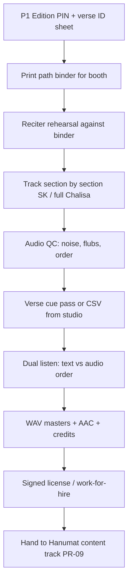

# Hanumat — Audio Commission Brief

| Field | Value |
|-------|-------|
| **Product** | Hanumat |
| **Document** | Path audio commissioning brief (P3) |
| **Date** | 2026-07-21 |
| **Status** | Draft for commission — strategy **locked: new commissioned recitations** |
| **Depends on** | [`edition-shortlist.md`](./edition-shortlist.md) (P1 PIN before final SK record) |
| **Design ref** | `docs/design/hanuman-mandir-design.md` (P3, Path Studio, segments, cues) |
| **Version** | 1.0.0 |

---

## 1. Purpose

Commission **original studio recitations** of core path texts so Hanumat owns (or exclusively licenses) audio suitable for:

- Verse-synced Path Studio (karaoke / highlight)
- Section-segmented Sundar Kand (1.5–3h total)
- Offline Chalisa pack (Wave 0)
- Quiet, sacred UX — no ads, no watermark voice tags mid-path

**Strategy (locked):** Commission **new** performances. Do not license random YouTube rips. Placeholders only for **internal** engineering until delivery.

---

## 2. Scope of commission (waves)

### Wave 0 — Trust core (must commission first)

| Package ID | Text | Structure | Est. duration | Priority |
|------------|------|-----------|---------------|----------|
| **AUD-W0-CH** | Hanuman Chalisa | Full path, single continuous take (+ optional alternate tempo) | ~8–12 min | P0 |
| **AUD-W0-SK** | Sundar Kand (Manas) | **Section/episode-segmented** full kand per PIN’d edition | ~90–180 min total | P0 |

Optional same-wave if budget allows:

| Package ID | Text | Notes |
|------------|------|--------|
| AUD-W0-CH-SLOW | Chalisa slow learning pace | Clear sandhi, slightly slower; great for first-time reciters |

### Wave 1 — Daily devotee (brief later; keep in pipeline)

- Bajrang Baan  
- Sankatmochan Hanuman Ashtak  
- Hanuman Aarti (classic)  
- Ashtottara (108 names) — may be chant-style  

### Wave 2+

- Hanuman Bahuk  
- Kavach / Panchmukhi  
- Maruti Stotra  
- Valmiki Sundarakanda (different language/meter — separate brief)  

**This document details Wave 0 packages only.**

---

## 3. Artistic direction

### Tone

| Attribute | Target |
|-----------|--------|
| Mood | Devotional, steady, clear — **path-style**, not concert melodrama |
| Energy | Warm strength (Hanuman), not aggressive shouting |
| Space | Enough silence between verses for UI highlight and listener breath |
| Ornament | Minimal; no long alaaps that break verse timing |
| Emotion | Shraddhā > showmanship |

### Voice

| Preference | Guidance |
|------------|----------|
| **Primary** | One primary reciter for W0 (consistency across Chalisa + SK) |
| Gender | Open — choose clarity and bhakti over stereotype |
| Language comfort | Flawless Devanagari path pronunciation; Awadhi Manas awareness (not “correcting” into pure modern Hindi) |
| Accent | North Indian path-standard acceptable; avoid extreme regional distortion of established path forms |
| Backup | Optional second reciter for future “voice pack”; not required for W0 launch |

### Musical bed

| Element | Wave 0 default |
|---------|----------------|
| Tanpura / light drone | **Optional alternate mix** — primary deliverable is **dry or very light** bed so verse onsets stay detectable |
| Bells / heavy orchestra | **No** on primary path track |
| Karaoke instrumental-only | Optional later; not blocking |

Deliver:

1. **Primary mix** — recitation-forward, minimal bed (or dry)  
2. Optional **soft-bed mix** if easy same session  

---

## 4. Technical deliverables (non-negotiable)

### File masters

| Spec | Requirement |
|------|-------------|
| Sample rate | 48 kHz (or 44.1 kHz if studio standard — pick one and keep all W0 consistent) |
| Bit depth | 24-bit WAV masters |
| Distribution encode | AAC (or high-quality M4A) for web — Hanumat eng will transcode if you deliver WAV |
| Channels | Mono or stereo consistent; peak-normalized, no brickwall smash |
| Loudness | Target approx. **−16 to −14 LUFS** integrated for speech-forward path; true peak ≤ −1 dBTP |
| Room | Dry-ish studio; no heavy reverb tails that blur verse ends |

### Segmentation (Sundar Kand)

Align to Hanumat **editorial episodes** (same as `structure.json` after edition PIN):

| Deliverable | Description |
|-------------|-------------|
| One WAV (or AAC) **per section/episode** | Filename: `sk_{sectionId}_v1.wav` |
| **Section cue sheet** | Start of file = start of first verse in that section |
| No mid-verse file splits | Never cut inside a chaupai/doha |
| Gapless-friendly tails | Short natural breath at end; avoid long dead air (>2s) unless editorial asks |
| Full-kand continuous master | Optional archival single file; **product uses segments** |

### Chalisa

| Deliverable | Description |
|-------------|-------------|
| Single continuous master | `chalisa_full_v1.wav` |
| Optional slow master | `chalisa_slow_v1.wav` |

### Cue / timing data

Commission includes **timing assist**, not only audio:

| Option | Description | Preferred |
|--------|-------------|-----------|
| **A. Studio CSV** | `verseId,startMs,endMs` per take | **Preferred** if reciter/engineer can mark during session |
| **B. Rough section stamps only** | Hanumat editors finish verse cues | Acceptable fallback |
| **C. Hanumat-only cue** | We cue entirely in post | Highest internal cost |

**Target accuracy:** verse highlight within **±150 ms** of audible onset for Path Studio.

Use **PIN’d edition order** only. Verse IDs supplied by Hanumat as spreadsheet before session (after P1).

### Credits metadata (per track)

```text
title, reciter legal name + display name, recording date, studio,
composer/tradition note ("traditional path / Tulsidas"),
ISRC if any, license grant reference, version tag (v1)
```

---

## 5. Session workflow (recommended)



### Booth rules

1. Binder = **exact PIN text**; no memory-only for SK.  
2. Retake any verse with wrong word, order skip, or muddy diction.  
3. Announce section ID **slate** at head of each SK file (slate stripped or left out of product encode).  
4. Water / sindoor-level respect in room culture — professional calm.

### Retake policy

- Budget **15–20%** time for retakes.  
- SK: prefer retake **section**, not whole kand, if error isolated.

---

## 6. Rights & legal (must be in contract)

| Clause | Requirement |
|--------|-------------|
| **Grant** | Worldwide, perpetual, irrevocable license **or** work-made-for-hire assignment to Hanumat owner for use in app, web, PWA, offline packs, trailers (short promo) |
| **Sync / display** | Explicit right to **display text synchronized** with audio and to distribute timed cue data |
| **Derivative** | Right to create alternate encodes, speed variants (±10% if needed), offline packs, clips for section previews (≤60s) with credit |
| **Exclusivity** | Prefer **exclusive digital path use** for these takes for N years (negotiate); at minimum non-exclusive but **no third-party exclusive** that blocks us |
| **Credit** | Reciter credited in-app (Learn / track credits); no forced mid-path vocal watermark |
| **Moral rights** | Waiver/consent as needed for editing breaths, light EQ, sectioning |
| **No stock claim** | Reciter warrants performance is original; no uncleared samples |
| **Delivery escrow** | Final payment on WAV + metadata + signed grant |

**Owner of commissioned HI/EN meanings** is separate copywriting contract (or same vendor if dual-skilled) — audio brief does not include authorship of meanings.

---

## 7. Reciter profile (casting)

### Must-have

- [ ] Experience with **Ramcharitmanas / Chalisa path** (not only filmi bhajan style)  
- [ ] Clear articulation at path pace  
- [ ] Comfort with long SK sessions (stamina, consistency day-to-day)  
- [ ] Willing to work to a **fixed printed edition** (no improvising variant lines)  
- [ ] Comfortable with digital product use + credit model  

### Nice-to-have

- Prior Gita Press–aligned path teaching or mandir path lead  
- Ability to mark verse starts in session (foot pedal / engineer marks)  
- Separate soft “aarti” skill for Wave 1  

### Out of scope for W0 primary

- Children’s cartoon voice  
- Extreme theatrical Ramlila-only style that breaks meter  
- Heavy electronic production  

---

## 8. Budget & timeline framework

*Fill numbers when product sets budget. Structure below is the negotiation scaffold.*

| Package | Effort driver | Payment split suggestion |
|---------|---------------|---------------------------|
| AUD-W0-CH | 1 session + 1 fix | 30% advance / 70% on accept |
| AUD-W0-SK | Multi-day tracking + QC | 30% / 40% on full WAV / 30% on cue acceptance |
| Cue assist | Per hour or bundled | Bundle preferred |

### Suggested timeline (after P1 PIN + contract)

| Week | Milestone |
|------|-----------|
| 0 | Contract + verse ID sheet + binder PDF |
| 1 | Reciter rehearsal |
| 2 | Chalisa tracked + accepted |
| 3–5 | SK sections tracked (rolling) |
| 6 | Cue QC complete for Chalisa + all SK sections |
| 7 | Legal close + masters in media bucket |

**Public Wave 0** cannot claim “full SK audio” until SK package accepted (design acceptance matrix).

---

## 9. Acceptance checklist (Hanumat)

### Audio

- [ ] Correct text order vs PIN (spot-check 100% section opens + random 20 verses/section)  
- [ ] No missing sections vs `structure.json`  
- [ ] Diction intelligible on mid-range Android speaker  
- [ ] Loudness within target; no clipping  
- [ ] Section files named and mapped in `AudioTrackManifest.segments[]`  

### Cues

- [ ] Every verse in section has cue; IDs match content JSON  
- [ ] Monotonic startMs; no overlaps  
- [ ] Spot-check ±150 ms on 20 random cues/section  
- [ ] `cueMap.version` bumped on any fix  

### Legal

- [ ] Signed grant on file  
- [ ] Credits JSON complete  
- [ ] `meta.flags.placeholderAudio: false` only after above  

---

## 10. Engineering handoff

| Artifact | Destination |
|----------|-------------|
| WAV masters | Private archive |
| AAC/M4A web encodes | CDN `MEDIA_BASE_URL/audio/...` |
| Segment list + durations | `content/texts/.../audio/*.yaml` |
| Cue maps | `content/texts/.../audio/cues/*.json` |
| Credits | `content/texts/.../meta.yaml` + Learn credits page |
| Pack | `content/packs/pack-chalisa-v1.json` (Chalisa only W0) |

Player behavior (already in design): Full mode = ordered segment playlist; Section mode = one segment; resume stores `segmentId` + `positionMs` + `verseId`.

---

## 11. Soft bed / ambience (optional add-on)

If budget remains:

| ID | Use |
|----|-----|
| AMB-TANPURA-LOOP | Optional under-recitation bed, duckable |
| AMB-NIGHT | Sankat / night mode bed (Wave 1) |

Must be **original or fully cleared**; never uncleared temple field recording with crowd noise as default path bed.

---

## 12. Contact sheet (fill in)

| Role | Name | Contact |
|------|------|---------|
| Product owner | | |
| Editorial lead | | |
| Audio producer | | |
| Reciter | *TBD casting* | |
| Recording studio | *TBD* | |
| Legal | | |

---

## 13. Open items before sending to talent

- [ ] **P1 edition PIN** completed (`edition-shortlist.md` checklist)  
- [ ] Verse ID spreadsheet generated from content schema sample → full SK as sections land  
- [ ] Budget ceiling approved  
- [ ] Contract template reviewed  
- [ ] Casting shortlist (2–3 voices), listen test: 1 min Chalisa + 1 min SK  

---

## 14. One-page brief for talent (copy-paste)

> **Project:** Hanumat — digital mandir path app (no ads in path).  
> **Job:** Studio recitation of Hanuman Chalisa (full) and Rāmcaritmānas Sundar Kāṇḍ (full, section by section) from a fixed Gita Press–collated print we provide.  
> **Style:** Clear traditional path, calm bhakti, minimal ornament, steady pace suitable for on-screen verse highlight.  
> **Deliverables:** 24-bit WAV masters per section (SK) + full Chalisa; help mark verse timings if possible.  
> **Rights:** Paid commission for worldwide digital use in our app/PWA/offline packs with name credit.  
> **Not wanted:** Filmi remix energy, heavy music bed on primary take, improvised alternate lyrics.

---

## Revision history

| Ver | Date | Notes |
|-----|------|-------|
| 1.0.0 | 2026-07-21 | Initial brief; strategy commission-locked |
